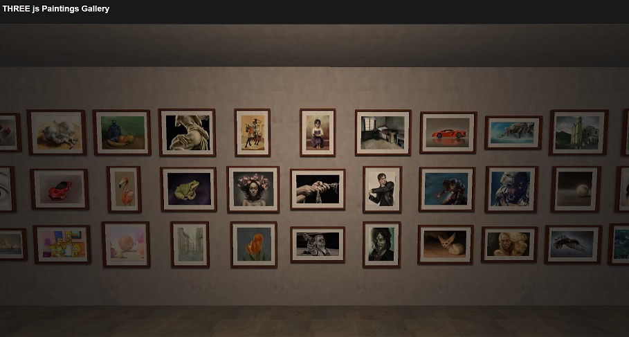

# three_js_paintings_gallery
simple THREE.js dynamically generated paintings gallery

A simple 3D painting gallery, dynamically generated from the contents of a JSON file.

The JSON file stores various information for each painting, including its description, image path, video link showcasing the drawing process, and the associated drawing process file.
The project is still undergoing some refinements.

You can see the gallery in action on the official SpeedyPainter website:
[SpeedyPainter - gallery](https://speedypainter.altervista.org/gallery/index.php)
